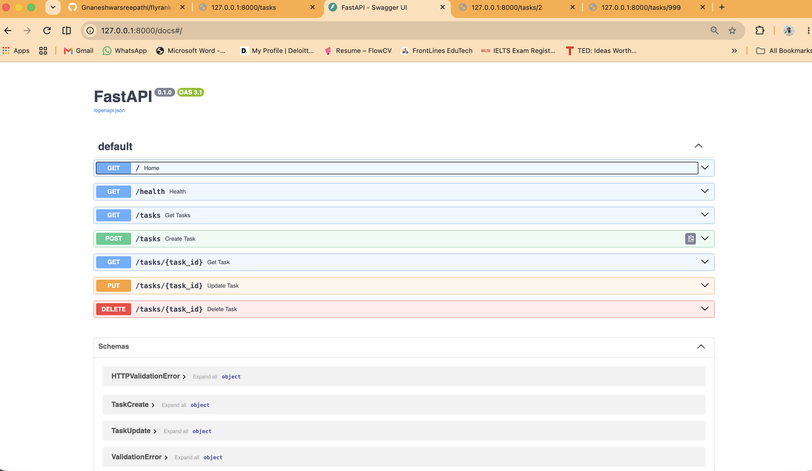
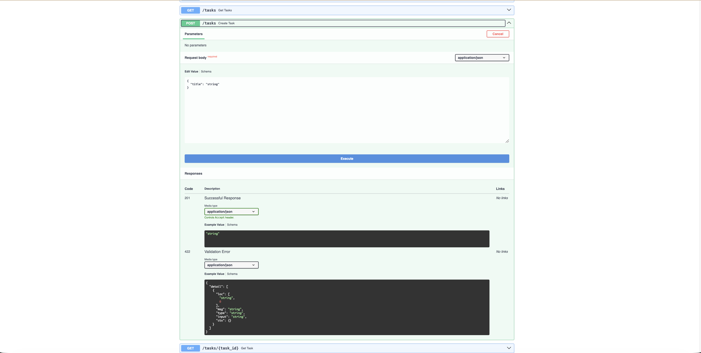
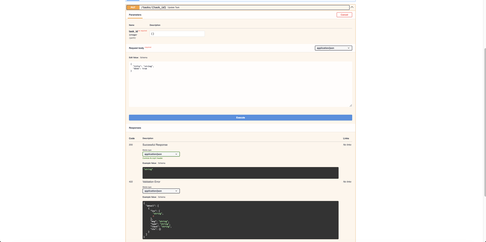
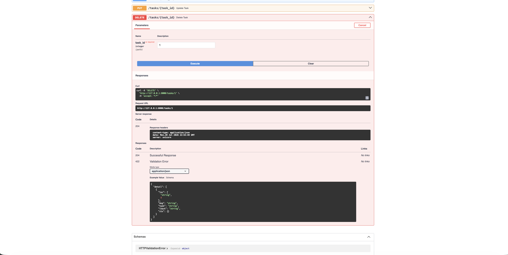
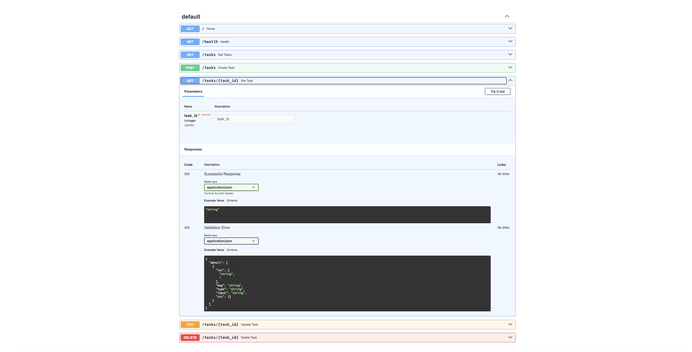

# 🚀 Backend AI Engineering – Week 2
## Building a CRUD Task API with FastAPI

> **FlyRank AI Internship | Backend AI Engineering Track**

---

# 📖 Introduction

This repository contains my **Week 2 assignment** for the **FlyRank AI Backend Engineering Internship**.

In Week 1, I started with the fundamentals of backend development by building a minimal FastAPI server and understanding the basic:

```text
Client → Request → Backend → Response
```

In Week 2, I extended those fundamentals by building a more realistic **Task Management REST API**.

Instead of only returning static JSON responses, this API can now:

- Create tasks
- Read all tasks
- Read a specific task
- Update an existing task
- Delete a task
- Validate incoming request data
- Return appropriate HTTP status codes
- Handle errors such as missing tasks
- Provide automatically generated Swagger API documentation

This assignment introduced me to one of the most important concepts in backend engineering:

> **CRUD — Create, Read, Update, and Delete**

---

# 🎯 Assignment Goal

The goal of this assignment was to build a small REST API that demonstrates the fundamental operations used by backend applications.

The API needed to support:

```text
CREATE
READ
UPDATE
DELETE
```

These operations are commonly referred to as **CRUD**.

The project also demonstrates:

- HTTP methods
- REST API endpoints
- Path parameters
- Request bodies
- JSON responses
- Pydantic validation
- HTTP status codes
- Error handling
- In-memory data storage
- Swagger/OpenAPI documentation
- API testing

---

# 🔄 Week 1 → Week 2 Progression

In Week 1, the backend mainly returned predefined responses.

Example:

```text
GET /
        ↓
Backend receives request
        ↓
Returns predefined JSON
```

In Week 2, the backend performs operations on data.

```text
Client
   ↓
HTTP Request
   ↓
FastAPI
   ↓
Validate Input
   ↓
Perform CRUD Operation
   ↓
Return JSON Response
   ↓
Client
```

This makes the backend more interactive and closer to how real applications work.

---

# 🤔 What is CRUD?

CRUD represents the four basic operations performed on application data.

| CRUD Operation | HTTP Method | Purpose |
|---|---|---|
| Create | POST | Create new data |
| Read | GET | Retrieve existing data |
| Update | PUT | Modify existing data |
| Delete | DELETE | Remove existing data |

For this project:

```text
POST   /tasks       → Create a task

GET    /tasks       → Read all tasks

GET    /tasks/{id}  → Read one task

PUT    /tasks/{id}  → Update a task

DELETE /tasks/{id}  → Delete a task
```

---

# 🍽 Simple CRUD Analogy

Imagine a notebook containing a list of tasks.

You can:

```text
Write a new task
        ↓
CREATE

Look at your tasks
        ↓
READ

Change an existing task
        ↓
UPDATE

Remove a task
        ↓
DELETE
```

A backend API performs the same operations programmatically.

---

# 📂 Project Structure

```text
flyrank-ai-backend-internship/

├── week-1/
│
├── week-2/
│   │
│   ├── images/
│   │   ├── swagger-api-overview.png
│   │   ├── create-task.png
│   │   ├── update-task.png
│   │   ├── delete-task.png
│   │   └── error-handling.png
│   │
│   ├── main.py
│   └── requirements.txt
│
├── .gitignore
└── README.md
```

The `week-2` folder contains the complete implementation for this assignment.

---

# 🛠 Technologies Used

- Python
- FastAPI
- Pydantic
- Uvicorn
- REST API
- JSON
- HTTP
- Swagger UI / OpenAPI
- curl
- Git
- GitHub

---

# 🧠 Core Concepts Used

## 1. FastAPI

FastAPI is the Python web framework used to build the API.

It allows us to define endpoints such as:

```python
@app.get("/tasks")
```

and:

```python
@app.post("/tasks")
```

FastAPI also automatically provides interactive API documentation through Swagger UI.

---

## 2. Uvicorn

FastAPI defines the application, but we still need a server to run it.

That is the role of **Uvicorn**.

```text
FastAPI
    ↓
Defines API behavior

Uvicorn
    ↓
Runs the application and listens for HTTP requests
```

We start the application using:

```bash
uvicorn main:app --reload
```

---

## 3. Pydantic

Pydantic is used to define and validate incoming request data.

For example:

```python
class TaskCreate(BaseModel):
    title: str
```

This means that when someone creates a task, the request must contain:

```json
{
  "title": "Learn FastAPI"
}
```

If the required `title` field is missing, FastAPI and Pydantic automatically reject the invalid request.

---

# 🚀 Step-by-Step Development Process

## Step 1 – Import Required Components

```python
from fastapi import FastAPI, HTTPException, status
from pydantic import BaseModel
from typing import Optional
```

### Why are these imports needed?

`FastAPI`

Creates the backend API application.

`HTTPException`

Allows the API to return errors such as:

```text
404 Not Found
```

`status`

Provides readable HTTP status constants such as:

```python
status.HTTP_201_CREATED
```

instead of manually writing:

```python
201
```

`BaseModel`

Allows us to create Pydantic models for validating request data.

`Optional`

Allows fields to be optional when updating a task.

---

# Step 2 – Create the FastAPI Application

```python
app = FastAPI()
```

This creates the FastAPI application.

The variable:

```text
app
```

represents our backend API.

When we run:

```bash
uvicorn main:app --reload
```

Uvicorn looks for:

```text
main
 ↓
main.py

app
 ↓
app = FastAPI()
```

---

# Step 3 – Create the Task Input Models

## TaskCreate

```python
class TaskCreate(BaseModel):
    title: str
```

This model is used when creating a new task.

The client must provide:

```json
{
  "title": "Learn FastAPI"
}
```

Because `title` is required.

---

## TaskUpdate

```python
class TaskUpdate(BaseModel):
    title: Optional[str] = None
    done: Optional[bool] = None
```

This model is used when updating a task.

Both fields are optional because a user may want to update only one property.

For example:

```json
{
  "done": true
}
```

or:

```json
{
  "title": "Learn Advanced FastAPI"
}
```

or both:

```json
{
  "title": "Learn Advanced FastAPI",
  "done": true
}
```

---

# Step 4 – Create Temporary Task Storage

For this assignment, tasks are stored in a Python list.

Example:

```python
tasks = [
    {
        "id": 1,
        "title": "Learn FastAPI",
        "done": False
    },
    {
        "id": 2,
        "title": "Complete Week 2 Assignment",
        "done": False
    }
]
```

This is called:

> **In-memory storage**

The data exists only while the application is running.

If the server restarts:

```text
Application stops
        ↓
Memory is cleared
        ↓
Newly created tasks disappear
        ↓
Initial tasks are loaded again
```

In a production application, this would normally be replaced by a database such as:

```text
PostgreSQL
MySQL
MongoDB
```

---

# 🌐 API Endpoints

The application provides the following endpoints:

| Method | Endpoint | Purpose | Success Status |
|---|---|---|---|
| GET | `/` | Check API information | 200 |
| GET | `/health` | Check server health | 200 |
| GET | `/tasks` | Retrieve all tasks | 200 |
| POST | `/tasks` | Create a new task | 201 |
| GET | `/tasks/{task_id}` | Retrieve one task | 200 |
| PUT | `/tasks/{task_id}` | Update a task | 200 |
| DELETE | `/tasks/{task_id}` | Delete a task | 204 |

---

# 🏠 GET `/`

The root endpoint confirms that the Task API is running.

Example response:

```json
{
  "message": "Task API is running",
  "docs": "/docs"
}
```

The `/docs` value points users to the Swagger API documentation.

---

# ❤️ GET `/health`

The health endpoint checks whether the API is running.

```text
GET /health
```

Response:

```json
{
  "status": "ok"
}
```

Status:

```text
200 OK
```

Health endpoints are commonly used by:

- Cloud platforms
- Docker
- Kubernetes
- Load balancers
- Monitoring systems

to check whether an application is available.

---

# 📋 GET `/tasks`

This endpoint returns all available tasks.

```text
GET /tasks
```

Example response:

```json
[
  {
    "id": 1,
    "title": "Learn FastAPI",
    "done": false
  },
  {
    "id": 2,
    "title": "Complete Week 2 Assignment",
    "done": false
  }
]
```

Status:

```text
200 OK
```

---

# 🔍 GET `/tasks/{task_id}`

This endpoint retrieves one specific task.

Example:

```text
GET /tasks/1
```

FastAPI extracts:

```text
1
```

from the URL and passes it to:

```python
task_id: int
```

The API searches the task list for a matching ID.

If found:

```json
{
  "id": 1,
  "title": "Learn FastAPI",
  "done": false
}
```

Status:

```text
200 OK
```

If the task does not exist:

```text
GET /tasks/999
```

the API returns:

```text
404 Not Found
```

with an error response.

---

# ➕ POST `/tasks`

POST is used to create new data.

Request:

```text
POST /tasks
```

Request body:

```json
{
  "title": "Learn CRUD APIs"
}
```

The backend:

```text
Receives JSON
      ↓
Pydantic validates it
      ↓
Generates a new ID
      ↓
Sets done = false
      ↓
Adds task to the list
      ↓
Returns created task
```

Example response:

```json
{
  "id": 3,
  "title": "Learn CRUD APIs",
  "done": false
}
```

Status:

```text
201 Created
```

`201` is used because a **new resource was successfully created**.

---

# ✏️ PUT `/tasks/{task_id}`

PUT is used to update an existing task.

Example:

```text
PUT /tasks/3
```

Request body:

```json
{
  "title": "Learn Advanced CRUD APIs",
  "done": true
}
```

The backend:

```text
Receives task ID
       ↓
Validates request body
       ↓
Searches for task
       ↓
Updates provided fields
       ↓
Returns updated task
```

Example response:

```json
{
  "id": 3,
  "title": "Learn Advanced CRUD APIs",
  "done": true
}
```

Status:

```text
200 OK
```

If the task does not exist:

```text
404 Not Found
```

If no fields are supplied:

```json
{}
```

the API returns:

```text
400 Bad Request
```

because there is nothing to update.

---

# 🗑️ DELETE `/tasks/{task_id}`

DELETE removes an existing task.

Example:

```text
DELETE /tasks/3
```

The backend:

```text
Receives task ID
       ↓
Searches task list
       ↓
Finds matching task
       ↓
Removes task
       ↓
Returns 204
```

Successful response:

```text
204 No Content
```

A `204` response intentionally contains no response body.

If the task does not exist:

```text
404 Not Found
```

---

# 🛡️ Error Handling

Real APIs must handle both successful and unsuccessful requests.

This project handles several error cases.

## Task Not Found

Example:

```text
GET /tasks/999
```

Response:

```text
404 Not Found
```

This is handled using:

```python
raise HTTPException(
    status_code=404,
    detail="Task not found"
)
```

---

## Invalid Create Request

If a user tries:

```json
{}
```

with:

```text
POST /tasks
```

Pydantic detects that the required `title` field is missing.

FastAPI automatically returns a validation error:

```text
422 Unprocessable Content
```

---

## Empty Update

If a user sends:

```json
{}
```

to an update endpoint, there is nothing to update.

The API returns:

```text
400 Bad Request
```

---

# 📊 HTTP Status Codes Used

| Status Code | Meaning | Used For |
|---|---|---|
| 200 | OK | Successful GET and PUT |
| 201 | Created | New task successfully created |
| 204 | No Content | Task successfully deleted |
| 400 | Bad Request | Invalid update request |
| 404 | Not Found | Task does not exist |
| 422 | Unprocessable Content | Request validation failed |

Using correct HTTP status codes allows clients to understand what happened without relying only on response text.

---

# 🔄 Complete CRUD Flow

```text
CLIENT
   │
   ▼
HTTP REQUEST
   │
   ▼
UVICORN SERVER
   │
   ▼
FASTAPI
   │
   ▼
MATCH ENDPOINT
   │
   ▼
VALIDATE REQUEST
   │
   ▼
PYDANTIC MODEL
   │
   ▼
PERFORM CRUD OPERATION
   │
   ├── CREATE
   ├── READ
   ├── UPDATE
   └── DELETE
   │
   ▼
PYTHON DATA
   │
   ▼
FASTAPI CONVERTS DATA TO JSON
   │
   ▼
HTTP STATUS + RESPONSE
   │
   ▼
CLIENT
```

---

# 🚀 Getting Started

The following instructions allow anyone to clone and run the Week 2 project locally.

---

## Step 1 – Clone the Repository

Open a terminal and run:

```bash
git clone https://github.com/Gnaneshwarsreepathi/flyrank-ai-backend-internship.git
```

---

## Step 2 – Enter the Repository

```bash
cd flyrank-ai-backend-internship
```

---

## Step 3 – Enter Week 2

```bash
cd week-2
```

You should now be inside:

```text
flyrank-ai-backend-internship/week-2
```

---

## Step 4 – Verify Python

```bash
python3 --version
```

Expected:

```text
Python 3.x.x
```

---

## Step 5 – Create a Virtual Environment

```bash
python3 -m venv venv
```

A virtual environment keeps project dependencies isolated from other Python projects.

---

## Step 6 – Activate the Virtual Environment

### macOS / Linux

```bash
source venv/bin/activate
```

### Windows Command Prompt

```cmd
venv\Scripts\activate
```

### Windows PowerShell

```powershell
venv\Scripts\Activate.ps1
```

After activation, the terminal should show something similar to:

```text
(venv)
```

---

## Step 7 – Install Dependencies

```bash
pip install -r requirements.txt
```

This installs the packages required by the project.

---

## Step 8 – Start the API Server

```bash
uvicorn main:app --reload
```

Expected output:

```text
INFO: Uvicorn running on http://127.0.0.1:8000
```

Keep this terminal running.

---

# 🌐 Access the Application

## Root Endpoint

Open:

```text
http://127.0.0.1:8000/
```

---

## Health Check

```text
http://127.0.0.1:8000/health
```

---

## View All Tasks

```text
http://127.0.0.1:8000/tasks
```

---

## View One Task

```text
http://127.0.0.1:8000/tasks/1
```

---

## Swagger API Documentation

Open:

```text
http://127.0.0.1:8000/docs
```

Swagger UI provides an interactive interface where every endpoint can be tested directly from the browser.

---

# 🧪 Testing with curl

Keep the FastAPI server running and open another terminal.

---

## Health Check

```bash
curl -i http://127.0.0.1:8000/health
```

---

## Get All Tasks

```bash
curl -i http://127.0.0.1:8000/tasks
```

---

## Get One Task

```bash
curl -i http://127.0.0.1:8000/tasks/1
```

---

## Create a Task

```bash
curl -i -X POST http://127.0.0.1:8000/tasks \
-H "Content-Type: application/json" \
-d '{"title":"Learn CRUD APIs"}'
```

Expected:

```text
201 Created
```

---

## Update a Task

Use the ID returned when the task was created.

Example:

```bash
curl -i -X PUT http://127.0.0.1:8000/tasks/3 \
-H "Content-Type: application/json" \
-d '{"title":"Learn Advanced CRUD APIs","done":true}'
```

Expected:

```text
200 OK
```

---

## Delete a Task

```bash
curl -i -X DELETE http://127.0.0.1:8000/tasks/3
```

Expected:

```text
204 No Content
```

---

## Test 404 Error Handling

```bash
curl -i http://127.0.0.1:8000/tasks/999
```

Expected:

```text
404 Not Found
```

---

# 📸 Project Screenshots

The following screenshots demonstrate the implementation and testing of the API.

---

## 📚 Swagger API Overview

FastAPI automatically generates interactive Swagger/OpenAPI documentation containing all available endpoints.

<p align="center">
  
</p>

---

## ➕ Creating a Task — 201 Created

The POST endpoint accepts JSON input, validates it using Pydantic, creates a new task, and returns:

```text
201 Created
```

<p align="center">
  
</p>

---

## ✏️ Updating a Task — 200 OK

The PUT endpoint allows an existing task's title or completion status to be updated.

<p align="center">
  
</p>

---

## 🗑️ Deleting a Task — 204 No Content

The DELETE endpoint removes an existing task and returns:

```text
204 No Content
```

<p align="center">
  
</p>

---

## ⚠️ Error Handling — 404 Not Found

When a requested task does not exist, the API returns an appropriate:

```text
404 Not Found
```

response.

<p align="center">
  
</p>

---

# 🧪 API Verification

The following scenarios were manually tested using Swagger UI and curl:

```text
GET    /health              → 200 OK

GET    /tasks               → 200 OK

GET    /tasks/1             → 200 OK

GET    /tasks/999           → 404 Not Found

POST   /tasks               → 201 Created

POST   /tasks with {}       → 422 Validation Error

PUT    /tasks/{id}          → 200 OK

PUT    /tasks/999           → 404 Not Found

PUT    /tasks/1 with {}     → 400 Bad Request

DELETE /tasks/{id}          → 204 No Content

GET deleted task            → 404 Not Found

DELETE /tasks/999           → 404 Not Found
```

This verifies both the successful API flows and important error-handling scenarios.

---

# 💡 Key Difference Between Week 1 and Week 2

## Week 1

```text
Request
   ↓
Static Python function
   ↓
JSON Response
```

I learned the basic backend request-response lifecycle.

## Week 2

```text
Request
   ↓
Endpoint
   ↓
Path Parameter / Request Body
   ↓
Pydantic Validation
   ↓
CRUD Logic
   ↓
In-Memory Data
   ↓
HTTP Status
   ↓
JSON Response
```

Week 2 introduced actual data manipulation and REST API design.

---

# 🎓 What I Learned

After completing this assignment, I gained practical experience with:

- REST API fundamentals
- CRUD operations
- FastAPI routing
- GET requests
- POST requests
- PUT requests
- DELETE requests
- Path parameters
- JSON request bodies
- Pydantic models
- Request validation
- Optional update fields
- HTTP status codes
- `HTTPException`
- Error handling
- In-memory data storage
- Swagger/OpenAPI documentation
- API testing using Swagger UI
- API testing using curl
- Git and GitHub workflow

Most importantly, I developed a clearer understanding of how a backend moves from simply **responding to requests** to actually **receiving, validating, processing, modifying, and returning data**.

---

# ⚠️ Current Limitation

This project intentionally uses an in-memory Python list for learning purposes.

This means newly created or updated data is not permanently stored.

```text
Server Running
      ↓
Tasks exist in memory

Server Restarted
      ↓
Memory resets

Initial tasks return
```

A production application would normally use persistent database storage.

---

# 🚀 Future Improvements

Possible next steps for this API include:

- Connect the API to a database
- Use PostgreSQL or another persistent datastore
- Add database models
- Add user authentication
- Add pagination
- Add filtering and searching
- Add automated API tests
- Containerize the application with Docker
- Add CI/CD
- Deploy the API to a cloud platform
- Add logging and monitoring
- Integrate AI-powered functionality

---

# 👨‍💻 Author

**Sreepathi Gnaneshwar**

Backend AI Engineering Intern @ FlyRank AI

GitHub:  
https://github.com/Gnaneshwarsreepathi