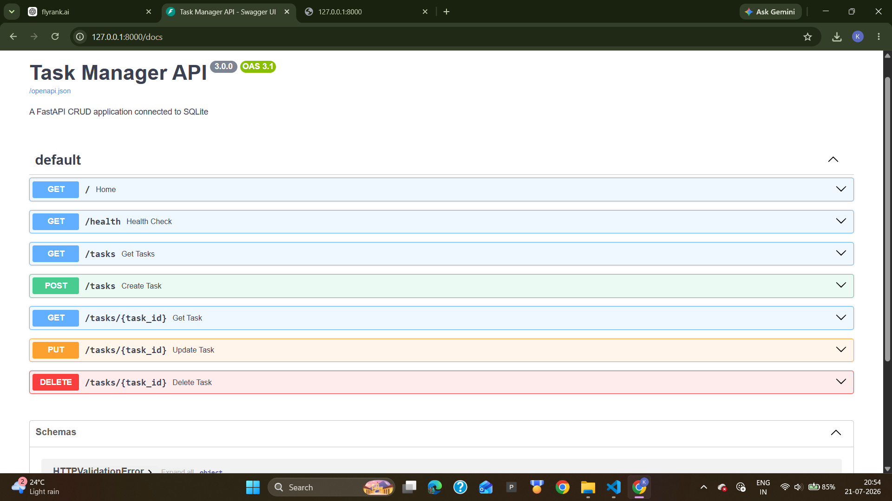

# Week 3 — FastAPI CRUD API with SQLite

This project extends the Week 2 Task Manager API by replacing the temporary in-memory Python list with a persistent SQLite database.

The application supports complete CRUD operations and preserves task data after the FastAPI server restarts.

## Features

- Automatically creates the SQLite database
- Automatically creates the `tasks` table
- Inserts three starter tasks only when the table is empty
- Creates new tasks using SQL `INSERT`
- Reads tasks using SQL `SELECT`
- Updates tasks using SQL `UPDATE`
- Deletes tasks using SQL `DELETE`
- Preserves data after server restarts
- Returns proper HTTP status codes
- Handles invalid requests and missing task IDs
- Provides Swagger API documentation

## Technologies Used

- Python
- FastAPI
- SQLite
- Pydantic
- Uvicorn
- DB Browser for SQLite
- Swagger UI

## Project Structure

```text
week-3/
├── images/
│   ├── sqlite-exploration.png
│   └── swagger-crud-overview.png
├── main.py
├── README.md
└── requirements.txt
```

The `tasks.db` file is generated automatically when the application starts. It is excluded from Git using `.gitignore`.

## Database Schema

The application automatically creates the following table:

```sql
CREATE TABLE IF NOT EXISTS tasks (
    id INTEGER PRIMARY KEY AUTOINCREMENT,
    title TEXT NOT NULL,
    done INTEGER NOT NULL DEFAULT 0
);
```

| Column | Type | Description |
|---|---|---|
| `id` | INTEGER | Unique task identifier |
| `title` | TEXT | Task title |
| `done` | INTEGER | Task completion status |

SQLite stores Boolean values as integers:

```text
0 = false
1 = true
```

The API converts SQLite values into JSON Boolean values.

## Automatic Database Initialization

When the application starts:

1. SQLite creates `tasks.db` when it does not exist.
2. The application creates the `tasks` table.
3. The application checks how many tasks are stored.
4. Three starter tasks are inserted only when the table is empty.

This prevents duplicate seed tasks when the server restarts.

## API Endpoints

| Method | Endpoint | Description | Success Code |
|---|---|---|---:|
| GET | `/` | Welcome message | 200 |
| GET | `/health` | Health check | 200 |
| GET | `/tasks` | Get all tasks | 200 |
| GET | `/tasks/{task_id}` | Get one task | 200 |
| POST | `/tasks` | Create a task | 201 |
| PUT | `/tasks/{task_id}` | Update a task | 200 |
| DELETE | `/tasks/{task_id}` | Delete a task | 204 |

## Example Requests

### Create a task

```http
POST /tasks
```

Request body:

```json
{
  "title": "Practice SQLite"
}
```

Example response:

```json
{
  "id": 4,
  "title": "Practice SQLite",
  "done": false
}
```

### Update a task

```http
PUT /tasks/1
```

Request body:

```json
{
  "title": "Learn advanced SQLite",
  "done": true
}
```

Example response:

```json
{
  "id": 1,
  "title": "Learn advanced SQLite",
  "done": true
}
```

### Delete a task

```http
DELETE /tasks/1
```

Successful deletion returns:

```text
204 No Content
```

A successful `204` response does not contain a response body.

## Error Handling

### Task not found

Status:

```text
404 Not Found
```

Response:

```json
{
  "error": "Task not found"
}
```

### Missing or blank task title

Status:

```text
400 Bad Request
```

Response:

```json
{
  "error": "Title is required"
}
```

### Empty update request

Status:

```text
400 Bad Request
```

Response:

```json
{
  "error": "Provide title or done"
}
```

### Blank title during update

Status:

```text
400 Bad Request
```

Response:

```json
{
  "error": "Title cannot be blank"
}
```

## SQL Queries Explored

The SQLite database was manually explored using DB Browser for SQLite.

### View all tasks

```sql
SELECT * FROM tasks;
```

### View completed tasks

```sql
SELECT * FROM tasks WHERE done = 1;
```

### Count all tasks

```sql
SELECT COUNT(*) FROM tasks;
```

### Mark all tasks as completed

```sql
UPDATE tasks SET done = 1;
```

### Delete completed tasks

```sql
DELETE FROM tasks WHERE done = 1;
```

Changes made manually in DB Browser were reflected in the FastAPI responses because both applications use the same `tasks.db` file.

## How to Run the Project

### 1. Clone the repository

```bash
git clone https://github.com/Gnaneshwarsreepathi/flyrank-ai-backend-internship.git
```

### 2. Enter the Week 3 folder

```bash
cd flyrank-ai-backend-internship/week-3
```

### 3. Create a virtual environment

Windows:

```powershell
py -m venv venv
```

### 4. Activate the virtual environment

PowerShell:

```powershell
.\venv\Scripts\Activate.ps1
```

### 5. Install the dependencies

```powershell
python -m pip install -r requirements.txt
```

### 6. Start the FastAPI server

```powershell
uvicorn main:app --reload
```

### 7. Open Swagger documentation

```text
http://127.0.0.1:8000/docs
```

### 8. View all tasks

```text
http://127.0.0.1:8000/tasks
```

## Database Persistence Test

Database persistence was verified using these steps:

1. A new task was created using `POST /tasks`.
2. The FastAPI server was stopped.
3. The server was started again.
4. The created task was still available through `GET /tasks`.

This confirms that task data is stored permanently in SQLite instead of a temporary Python list.

## Screenshots

### Swagger CRUD API



### SQLite Database Exploration


## Learning Outcomes

This assignment demonstrates:

- Connecting FastAPI with SQLite
- Creating databases and tables automatically
- Executing SQL CRUD operations
- Using parameterized SQL queries
- Converting database rows into JSON
- Managing SQLite database connections
- Validating API request bodies
- Returning correct HTTP status codes
- Testing database persistence
- Exploring SQLite using DB Browser