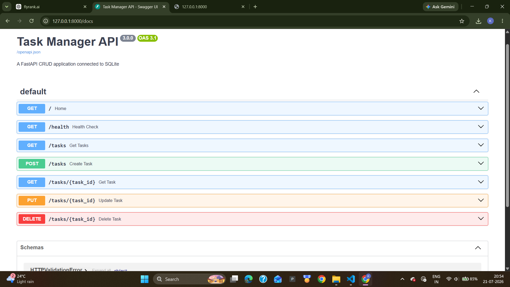
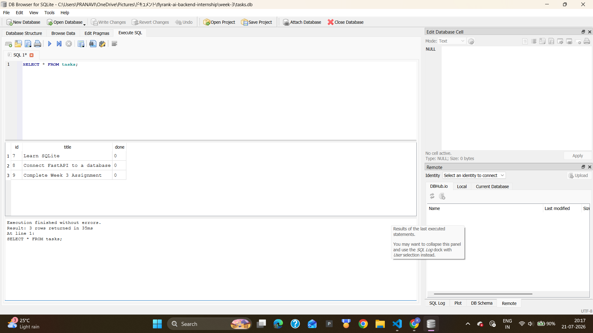

# Week 3 — FastAPI CRUD API with SQLite & PostgreSQL Docker

This project extends the Week 2 Task Manager API by replacing temporary in-memory storage with persistent database storage.

Week 3 contains two assignments:

- **A2 — Connecting CRUD to the Database**
- **A3 — Containerize Your Stack**

The project demonstrates CRUD operations, database persistence, PostgreSQL, Docker, Docker Compose, environment variables, and persistent Docker volumes.

---

# A2 — Connecting CRUD to the Database

## Overview

The original Week 2 application stored tasks in a temporary in-memory Python list.

For A2, the storage layer was replaced with a persistent SQLite database.

The API continues to expose the same CRUD endpoints while task data now survives FastAPI server restarts.

## Features

- Automatically creates the SQLite database
- Automatically creates the `tasks` table
- Inserts three starter tasks only when the table is empty
- Creates new tasks using SQL `INSERT`
- Reads tasks using SQL `SELECT`
- Updates tasks using SQL `UPDATE`
- Deletes tasks using SQL `DELETE`
- Preserves data after server restarts
- Returns appropriate HTTP status codes
- Handles invalid requests and missing task IDs
- Provides Swagger API documentation

## Technologies Used

- Python
- FastAPI
- SQLite
- Pydantic
- Uvicorn
- DB Browser for SQLite
- Swagger UI

## Project Structure

```text
week-3/
├── images/
│   ├── sqlite-exploration.png
│   └── swagger-crud-overview.png
├── main.py
├── README.md
├── requirements.txt
├── Dockerfile
├── docker-compose.yml
├── .env.example
└── sql/
    └── init.sql
```

The `tasks.db` SQLite database is generated automatically when the application runs and should not be committed to Git.

---

## SQLite Database Schema

The SQLite application creates the following table:

```sql
CREATE TABLE IF NOT EXISTS tasks (
    id INTEGER PRIMARY KEY AUTOINCREMENT,
    title TEXT NOT NULL,
    done INTEGER NOT NULL DEFAULT 0
);
```

| Column | Type | Description |
|---|---|---|
| `id` | INTEGER | Unique task identifier |
| `title` | TEXT | Task title |
| `done` | INTEGER | Task completion status |

SQLite stores Boolean values as integers:

```text
0 = false
1 = true
```

The API converts these values into JSON Boolean values.

---

## Automatic Database Initialization

When the application starts:

1. SQLite creates `tasks.db` if it does not exist.
2. The application creates the `tasks` table.
3. The application checks whether tasks already exist.
4. Three starter tasks are inserted only when the table is empty.

This prevents duplicate seed tasks when the server restarts.

---

# API Endpoints

| Method | Endpoint | Description | Success Code |
|---|---|---|---|
| GET | `/` | Welcome message | 200 |
| GET | `/health` | Health check | 200 |
| GET | `/tasks` | Get all tasks | 200 |
| GET | `/tasks/{task_id}` | Get one task | 200 |
| POST | `/tasks` | Create a task | 201 |
| PUT | `/tasks/{task_id}` | Update a task | 200 |
| DELETE | `/tasks/{task_id}` | Delete a task | 204 |

---

# Example Requests

## Create a Task

```http
POST /tasks
```

Request body:

```json
{
  "title": "Practice SQLite"
}
```

Example response:

```json
{
  "id": 4,
  "title": "Practice SQLite",
  "done": false
}
```

## Update a Task

```http
PUT /tasks/1
```

Request body:

```json
{
  "title": "Learn advanced SQLite",
  "done": true
}
```

Example response:

```json
{
  "id": 1,
  "title": "Learn advanced SQLite",
  "done": true
}
```

## Delete a Task

```http
DELETE /tasks/1
```

Successful deletion returns:

```text
204 No Content
```

A successful `204` response does not contain a response body.

---

# Error Handling

## Task Not Found

Status:

```text
404 Not Found
```

Response:

```json
{
  "error": "Task not found"
}
```

## Missing or Blank Task Title

Status:

```text
400 Bad Request
```

Response:

```json
{
  "error": "Title is required"
}
```

## Empty Update Request

Status:

```text
400 Bad Request
```

Response:

```json
{
  "error": "Provide title or done"
}
```

## Blank Title During Update

Status:

```text
400 Bad Request
```

Response:

```json
{
  "error": "Title cannot be blank"
}
```

---

# SQL Queries Explored

The SQLite database was manually explored using DB Browser for SQLite.

### View All Tasks

```sql
SELECT * FROM tasks;
```

### View Completed Tasks

```sql
SELECT * FROM tasks WHERE done = 1;
```

### Count All Tasks

```sql
SELECT COUNT(*) FROM tasks;
```

### Mark All Tasks as Completed

```sql
UPDATE tasks SET done = 1;
```

### Delete Completed Tasks

```sql
DELETE FROM tasks WHERE done = 1;
```

Changes made manually in DB Browser were reflected in the FastAPI API responses because both use the same `tasks.db` file.

---

# How to Run A2 — SQLite

## 1. Clone the Repository

```bash
git clone https://github.com/Gnaneshwarsreepathi/flyrank-ai-backend-internship.git
```

## 2. Enter the Week 3 Folder

```bash
cd flyrank-ai-backend-internship/week-3
```

## 3. Create a Virtual Environment

Windows:

```powershell
py -m venv venv
```

## 4. Activate the Virtual Environment

PowerShell:

```powershell
.\venv\Scripts\Activate.ps1
```

## 5. Install Dependencies

```bash
python -m pip install -r requirements.txt
```

## 6. Start FastAPI

```bash
uvicorn main:app --reload
```

## 7. Open Swagger Documentation

```text
http://127.0.0.1:8000/docs
```

## 8. View All Tasks

```text
http://127.0.0.1:8000/tasks
```

---

# SQLite Database Persistence Test

Database persistence can be verified using these steps:

1. Create a new task using `POST /tasks`.
2. Stop the FastAPI server.
3. Start the server again.
4. Run `GET /tasks`.
5. Confirm that the created task still exists.

This demonstrates that task data is stored persistently in SQLite instead of a temporary Python list.

---

# Screenshots

## Swagger CRUD API

The Swagger interface demonstrates the available CRUD endpoints.



## SQLite Database Exploration

DB Browser for SQLite was used to inspect the database and execute SQL queries manually.



---

# A3 — Containerize Your Stack

## Overview

For A3, the backend application was containerized using Docker.

The application and PostgreSQL database are managed together using Docker Compose.

The architecture is:

```text
Client
   |
   v
FastAPI Application
   |
   v
PostgreSQL Database
   |
   v
Docker Persistent Volume
```

The goal is to start the complete backend stack using one command.

---

# Technologies Used for A3

- Python 3.12
- FastAPI
- Uvicorn
- PostgreSQL 16
- Docker
- Docker Compose
- SQL
- Environment Variables
- Docker Volumes

---

# PostgreSQL Database

For A3, the database layer was changed from the SQLite implementation used in A2 to PostgreSQL.

PostgreSQL runs inside its own Docker container.

The FastAPI application connects to PostgreSQL using a database connection string provided through environment variables.

The database connection is not hard-coded into the application.

---

# Environment Variables

The PostgreSQL connection string is stored in `.env`.

Example:

```env
DATABASE_URL=postgresql://postgres:postgres@db:5432/tasks
```

The `.env` file is intentionally excluded from Git.

A `.env.example` file is included in the repository as a template.

Example `.env.example`:

```env
DATABASE_URL=postgresql://postgres:postgres@db:5432/tasks
```

---

# PostgreSQL Repository

The database storage implementation was replaced with a PostgreSQL repository.

The repository is responsible for:

- Creating tasks
- Reading tasks
- Reading a task by ID
- Updating tasks
- Deleting tasks

The service and API routes remain unchanged where the repository abstraction is used.

This demonstrates separation between the API layer and the data layer.

The architecture is:

```text
Client
   |
   v
FastAPI Routes
   |
   v
Service Layer
   |
   v
PostgreSQL Repository
   |
   v
PostgreSQL Database
```

---

# PostgreSQL Database Schema

The PostgreSQL table is created using:

```text
sql/init.sql
```

Example:

```sql
CREATE TABLE IF NOT EXISTS tasks (
    id SERIAL PRIMARY KEY,
    title TEXT NOT NULL,
    done BOOLEAN NOT NULL DEFAULT FALSE
);
```

---

# Docker Setup

The application is built using the `Dockerfile`.

The complete stack is managed using:

```text
docker-compose.yml
```

The stack contains two main services:

- `app`
- `db`

## App Service

The `app` service runs the FastAPI application.

## Database Service

The `db` service runs PostgreSQL 16.

A named Docker volume is attached to PostgreSQL so database data can survive container restarts.

---

# Build the Docker Image

```bash
docker compose build
```

# Start the Complete Stack

```bash
docker compose up -d --build
```

This command:

- Builds the FastAPI application image
- Starts the FastAPI container
- Starts the PostgreSQL container
- Creates the Docker network
- Creates the PostgreSQL persistent volume
- Initializes the database

---

# Check Running Containers

```bash
docker compose ps
```

The application and PostgreSQL containers should be running.

---

# View Application Logs

```bash
docker compose logs -f app
```

The FastAPI application runs on:

```text
http://0.0.0.0:8000
```

From the host machine, the API is available at:

```text
http://localhost:8000
```

---

# Swagger Documentation

FastAPI provides interactive API documentation.

Open:

```text
http://localhost:8000/docs
```

Alternative documentation:

```text
http://localhost:8000/redoc
```

---

# Test the API

## Get All Tasks

```bash
curl http://localhost:8000/tasks
```

## Get Task by ID

```bash
curl http://localhost:8000/tasks/1
```

## Create a Task

Using Swagger:

```http
POST /tasks
```

Example request:

```json
{
  "title": "Docker persistence test"
}
```

## Update a Task

```http
PUT /tasks/1
```

Example request:

```json
{
  "title": "Updated Docker task",
  "done": true
}
```

## Delete a Task

```http
DELETE /tasks/1
```

---

# PostgreSQL Persistence Test

Persistence can be verified by creating a task and restarting the application and database containers.

## Step 1 — Start the Stack

```bash
docker compose up -d --build
```

## Step 2 — Create a Task

Create a task using Swagger:

```http
POST /tasks
```

Example:

```json
{
  "title": "Persistence Test"
}
```

## Step 3 — Verify the Task

```bash
curl http://localhost:8000/tasks
```

The created task should appear.

## Step 4 — Stop the Containers

```bash
docker compose down
```

## Step 5 — Start the Stack Again

```bash
docker compose up -d
```

## Step 6 — Verify the Data

```bash
curl http://localhost:8000/tasks
```

The previously created task should still exist because PostgreSQL uses a persistent Docker volume.

---

# Docker Volume

PostgreSQL uses a named Docker volume to persist database data.

Stopping the stack with:

```bash
docker compose down
```

does not remove the named volume.

To completely remove the database and its stored data:

```bash
docker compose down -v
```

Use `docker compose down -v` only when intentionally resetting the database.

---

# Useful Docker Commands

## Build

```bash
docker compose build
```

## Start

```bash
docker compose up -d
```

## Build and Start

```bash
docker compose up -d --build
```

## Check Containers

```bash
docker compose ps
```

## View Application Logs

```bash
docker compose logs -f app
```

## View Database Logs

```bash
docker compose logs -f db
```

## Stop Containers

```bash
docker compose down
```

## Stop Containers and Remove Database Volume

```bash
docker compose down -v
```

---

# Access PostgreSQL

PostgreSQL can be accessed directly from the database container.

Run:

```bash
docker compose exec db psql -U postgres -d tasks
```

Then execute SQL queries.

## View All Tasks

```sql
SELECT * FROM tasks;
```

## Count Tasks

```sql
SELECT COUNT(*) FROM tasks;
```

## View Completed Tasks

```sql
SELECT * FROM tasks WHERE done = TRUE;
```

Exit PostgreSQL:

```text
\q
```

---

# Final Architecture

```text
                         Client
                           |
                           v
                  +------------------+
                  |   FastAPI App    |
                  |   Port 8000      |
                  +--------+---------+
                           |
                           v
                  +------------------+
                  |   PostgreSQL     |
                  |   Port 5432      |
                  +--------+---------+
                           |
                           v
                  +------------------+
                  | Docker Volume    |
                  | Persistent Data  |
                  +------------------+
```

---

# A2 → A3 Progression

The project demonstrates the evolution of the backend application.

## A2

```text
Client
   |
   v
FastAPI
   |
   v
SQLite
```

## A3

```text
Client
   |
   v
FastAPI Container
   |
   v
PostgreSQL Container
   |
   v
Docker Persistent Volume
```

The API contract remains unchanged while the storage implementation and infrastructure are improved.

---

# Assignment Requirements

## A2 — Connecting CRUD to Database

- [x] CRUD API maintained
- [x] SQLite database implemented
- [x] Database created automatically
- [x] Tasks table created automatically
- [x] Three starter tasks inserted only when the table is empty
- [x] CRUD operations implemented using SQL
- [x] Data survives application restart
- [x] Unknown IDs return 404
- [x] Invalid requests return appropriate errors
- [x] SQLite database manually explored using SQL

## A3 — Containerize Your Stack

- [x] PostgreSQL runs in Docker
- [x] PostgreSQL uses a persistent Docker volume
- [x] Database connection uses `.env`
- [x] `.env` is gitignored
- [x] `.env.example` is committed
- [x] SQL initialization file is provided
- [x] PostgreSQL repository implemented
- [x] FastAPI application containerized
- [x] Docker Compose used
- [x] Application and database can start together
- [x] CRUD API remains unchanged
- [x] Database persistence tested across container restart

---

# Learning Outcomes

This project demonstrates practical knowledge of:

- FastAPI
- REST API development
- CRUD operations
- SQL
- SQLite
- PostgreSQL
- Database repositories
- Separation of API and data layers
- Environment variables
- Docker
- Docker Compose
- Docker volumes
- Database initialization
- Persistent storage
- API testing
- PostgreSQL CLI

---

# Conclusion

Week 3 demonstrates how a backend application can evolve from temporary in-memory storage to persistent database storage and finally into a containerized application.

The API contract remains the same while the underlying storage and infrastructure are changed.

```text
Week 2
Client → FastAPI → In-Memory List

A2
Client → FastAPI → SQLite

A3
Client → FastAPI Container → PostgreSQL Container → Docker Volume
```

The final application can be started using:

```bash
docker compose up -d --build
```

The API is available at:

```text
http://localhost:8000
```

Swagger documentation:

```text
http://localhost:8000/docs
```
