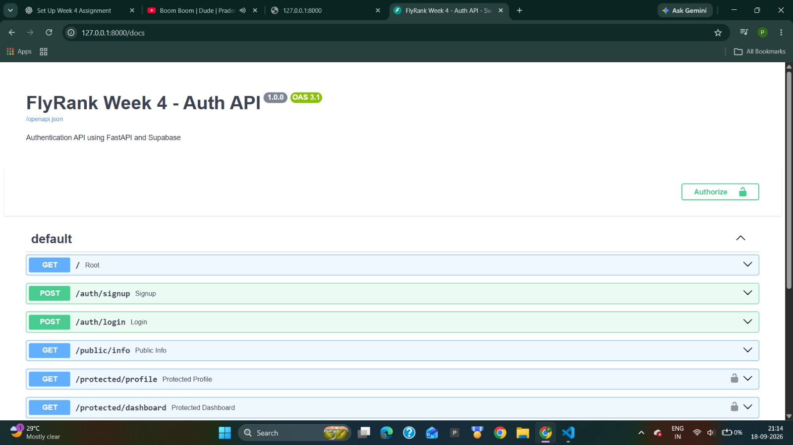
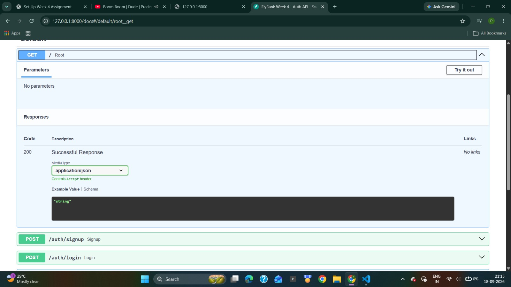

# FlyRank Week 4 - Authentication API

A secure REST API built using FastAPI and Supabase Authentication.

This project was developed as part of the FlyRank Backend AI Engineering Internship Week 4 assignment.

## Features

- User Sign Up
- User Login
- JWT Access Token Authentication
- Protected API Routes
- Public API Route
- User Profile
- Protected Dashboard
- User Logout
- Supabase Authentication
- Swagger/OpenAPI Documentation
- Bearer Token Authorization

## Tech Stack

- Python 3.12
- FastAPI
- Supabase
- Uvicorn
- Pydantic
- python-dotenv
- Git & GitHub

## Project Structure

```text
week-4/
├── main.py
├── requirements.txt
├── README.md
├── .gitignore
└── images/
    ├── image1.jpeg
    └── image2.jpeg
```

> The `.env` file contains sensitive Supabase credentials and must never be committed to Git.

## Environment Variables

Create a `.env` file in the project root:

```env
SUPABASE_URL=your_supabase_project_url
SUPABASE_KEY=your_supabase_publishable_key
```

Do not commit your actual `.env` file.

## Installation

Clone the repository:

```bash
git clone https://github.com/Gnaneshwarsreepathi/flyrank-ai-backend-internship.git
cd flyrank-ai-backend-internship/week-4
```

Create a virtual environment:

```bash
python3 -m venv venv
```

Activate it on macOS/Linux:

```bash
source venv/bin/activate
```

Install dependencies:

```bash
pip install -r requirements.txt
```

Create the `.env` file and add your Supabase credentials.

## Run the Server

```bash
python -m uvicorn main:app --reload
```

The API runs at:

```text
http://127.0.0.1:8000
```

Swagger documentation:

```text
http://127.0.0.1:8000/docs
```

## API Reference

| Method | Endpoint | Authentication | Description |
|---|---|---|---|
| GET | `/` | No | Server status |
| POST | `/auth/signup` | No | Create a user |
| POST | `/auth/login` | No | Login and receive JWT tokens |
| POST | `/auth/logout` | Yes | Logout authenticated user |
| GET | `/public/info` | No | Public information |
| GET | `/protected/profile` | Yes | Authenticated user's profile |
| GET | `/protected/dashboard` | Yes | Protected dashboard |

## Authentication

Login using:

```text
POST /auth/login
```

A successful login returns an access token and refresh token.

For protected routes, use the access token as a Bearer token.

### Using Swagger UI

1. Open `/docs`.
2. Register or log in using `/auth/signup` or `/auth/login`.
3. Copy the `access_token` returned by the login request.
4. Click **Authorize**.
5. Enter the access token.
6. Call the protected endpoints.

## HTTP Status Codes

| Status | Meaning |
|---|---|
| 200 | Successful request |
| 201 | User created successfully |
| 204 | Logout successful |
| 400 | Missing or invalid input |
| 401 | Missing, invalid, or expired authentication token |

## Swagger UI Screenshots

### Swagger API Overview



### Swagger Endpoint Details



The screenshots above show the FastAPI Swagger/OpenAPI documentation for the Week 4 Authentication API, including the available authentication, public, and protected endpoints.

## Security

Sensitive environment variables are stored in `.env`.

The `.env` file is excluded using `.gitignore` and is never committed to the repository.

JWT access tokens are verified using Supabase Authentication before protected endpoints are accessed.

## Author

Gnaneshwar Sreepathi

FlyRank Backend AI Engineering Internship  
Week 4 - Authentication API
