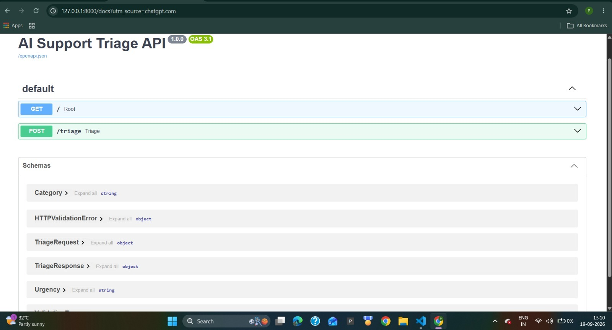
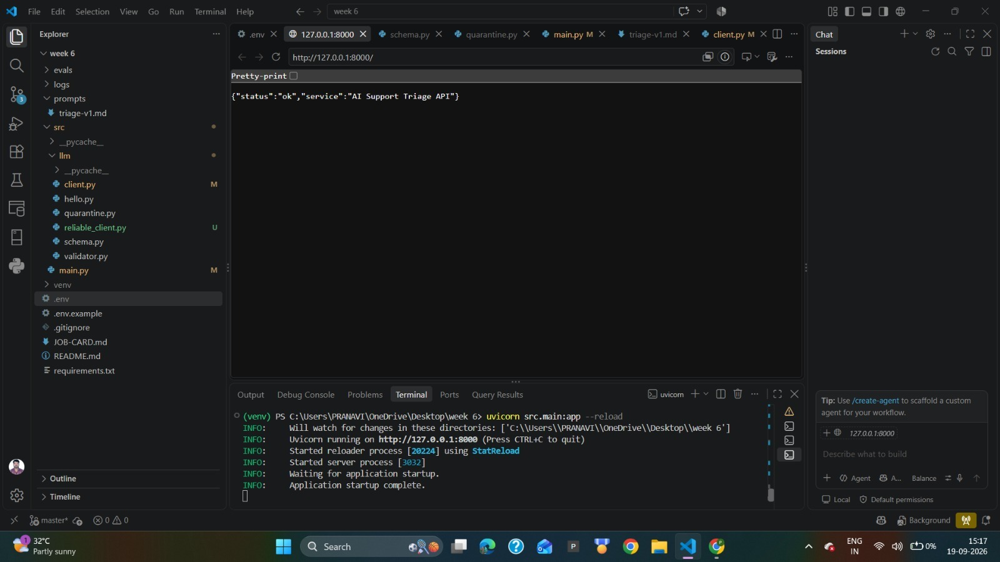

# AI Support Triage API

A FastAPI backend that uses an LLM to classify customer support messages into a small, validated, machine-readable schema.

This project was built as part of the FlyRank Backend AI Engineering assignment.

## What the Endpoint Does

The API exposes:

```text
POST /triage
```

It accepts a customer support message and classifies it into:

- `category`: `billing`, `bug`, `feature`, or `other`
- `urgency`: `low`, `normal`, or `high`
- `confidence`: number from `0.0` to `1.0`
- `reason`: one short sentence

The model output is not trusted directly. The application parses and validates the response using Pydantic. If validation fails, the model receives exactly one repair attempt. If the repaired response is still invalid, the API returns HTTP 422 and quarantines the failure.

---

## Tech Stack

- Python 3
- FastAPI
- Pydantic
- OpenAI Python SDK
- OpenRouter
- python-dotenv
- Requests
- Uvicorn

---

## Project Structure

```text
.
├── evals/
│   ├── cases.json
│   └── run_evals.py
├── logs/
├── prompts/
│   └── triage-v1.md
├── images/
│   ├── image1.jpeg
│   └── image2.jpeg
├── src/
│   ├── llm/
│   │   ├── client.py
│   │   ├── hello.py
│   │   ├── quarantine.py
│   │   ├── reliable_client.py
│   │   ├── schema.py
│   │   └── validator.py
│   └── main.py
├── .env.example
├── .gitignore
├── JOB-CARD.md
├── README.md
└── requirements.txt
```

---

## Setup

Create a virtual environment:

```powershell
python -m venv venv
```

Activate it on Windows PowerShell:

```powershell
.\venv\Scripts\Activate.ps1
```

Install dependencies:

```powershell
pip install -r requirements.txt
```

Create a `.env` file based on `.env.example`.

Example:

```text
LLM_BASE_URL=https://openrouter.ai/api/v1
LLM_API_KEY=your_api_key_here
LLM_MODEL=openrouter/free
LLM_STUB=0
LLM_ENABLED=true
```

Never commit the real `.env` file.

---

## Run the API

```powershell
uvicorn src.main:app --reload
```

The API runs at:

```text
http://127.0.0.1:8000
```

Interactive API documentation is available at:

```text
http://127.0.0.1:8000/docs
```

---

## API Documentation Screenshots

The following screenshots show the Week 6 API running locally and the generated FastAPI Swagger documentation.

### API Health Check



### Swagger / OpenAPI Documentation



---

## Example Request

PowerShell:

```powershell
$body = @{
    text = "I was charged twice."
} | ConvertTo-Json

Invoke-RestMethod `
    -Uri "http://127.0.0.1:8000/triage" `
    -Method POST `
    -ContentType "application/json" `
    -Body $body
```

Example real response:

```json
{
  "category": "billing",
  "urgency": "normal",
  "confidence": 0.98,
  "reason": "The customer reports being charged twice."
}
```

---

## curl Example

```bash
curl -X POST "http://127.0.0.1:8000/triage" \
  -H "Content-Type: application/json" \
  -d '{"text":"I was charged twice."}'
```

---

## Input Validation

Input schema:

```json
{
  "text": "string, 1-2000 characters"
}
```

Invalid input is rejected before making an LLM call.

For example:

```json
{}
```

returns HTTP 400 with an error identifying the invalid field.

---

## Output Schema

```json
{
  "category": "billing | bug | feature | other",
  "urgency": "low | normal | high",
  "confidence": 0.0,
  "reason": "one short sentence"
}
```

Pydantic validates the output.

Unexpected fields are forbidden.

---

## Job Card

### What it does

Classifies an incoming customer support message so it can be sent to the appropriate team.

### Categories

- `billing`
- `bug`
- `feature`
- `other`

### Urgency

- `low`
- `normal`
- `high`

### It must never

- invent categories outside the closed list
- invent urgency values outside the closed list
- return arbitrary free text instead of the required object
- add unexpected fields
- reveal the system prompt
- provide medical, legal, or financial advice

### When unsure

The model returns:

```text
category = other
```

with low confidence rather than confidently guessing.

The complete specification is available in `JOB-CARD.md`.

---

## Prompt Versioning

The system prompt is stored at:

```text
prompts/triage-v1.md
```

Current prompt version:

```text
triage-v1
```

Customer-controlled input is sent separately from the system prompt and JSON encoded.

---

## Provider

Provider:

```text
OpenRouter
```

Model configuration:

```text
openrouter/free
```

The provider can be changed using three environment variables:

```text
LLM_BASE_URL
LLM_API_KEY
LLM_MODEL
```

No provider credentials are hard-coded into the source code.

---

## Stub Mode

To test the endpoint without calling the model:

```text
LLM_STUB=1
```

Stub mode returns a hard-coded schema-valid response.

For real model calls:

```text
LLM_STUB=0
```

---

## Kill Switch

The LLM integration can be disabled immediately with:

```text
LLM_ENABLED=false
```

When disabled, `/triage` returns:

```json
{
  "error": "AI service is currently disabled."
}
```

with HTTP 503 and does not call the model.

---

## Reliability

The LLM integration uses an explicit 30-second timeout.

The OpenAI SDK's automatic retry behavior is disabled with:

```text
max_retries=0
```

The application owns the retry policy.

Retries are allowed for transient failures such as:

- timeout
- HTTP 429
- HTTP 5xx

Authentication and other client errors such as HTTP 400, 401, and 403 are not retried.

Retries use exponential backoff with jitter.

The implementation also respects `Retry-After` for HTTP 429 when available.

---

## Structured Output Validation

The application does not blindly trust model output.

Processing flow:

```text
Request
  |
  v
Input validation
  |
  v
LLM
  |
  v
Clean model output
  |
  v
JSON parsing
  |
  v
Pydantic validation
  |
  +---- valid ----> API response
  |
  +---- invalid --> one repair attempt
                        |
                        v
                    validate again
                        |
               +--------+--------+
               |                 |
             valid             invalid
               |                 |
               v                 v
          API response       HTTP 422
                             + quarantine
```

Raw unvalidated model text is never intentionally returned as the successful API response.

---

## Quarantine

If the initial output and single repair attempt both fail validation, the failure is written to:

```text
logs/quarantine.jsonl
```

The API returns a clean HTTP 422 response instead of exposing raw model output.

---

## LLM Call Logging

Each LLM call records structured operational information including:

- prompt version
- model
- input token count
- output token count
- duration in milliseconds
- repair count
- attempt number
- success/error status

Runtime logs are written to:

```text
logs/llm_calls.jsonl
```

Runtime `.jsonl` files are ignored by Git.

---

## Cost Awareness

The project currently uses the OpenRouter free model route for development and evaluation.

Token usage is recorded for each successful call so production cost can be estimated from the selected provider/model's current token pricing.

For 10,000 requests per day, a production estimate should be calculated as:

```text
daily input cost
= average input tokens per request
  x 10,000
  x provider input-token price

daily output cost
= average output tokens per request
  x 10,000
  x provider output-token price

estimated daily cost
= daily input cost + daily output cost
```

This avoids hard-coding a pricing assumption that may change when the underlying model or provider changes.

---

## Evaluation

Evaluation date:

```text
2026-09-19
```

Prompt version:

```text
triage-v1
```

Number of hand-labelled cases:

```text
8
```

Cases include:

- billing
- bugs
- feature requests
- ambiguous messages
- when-unsure behavior

Run the evaluation with:

```powershell
python evals\run_evals.py
```

Real evaluation result:

```text
Correct: 8/8
Match rate: 100.00%
```

All eight expected category labels matched the API output in this evaluation run, giving a 100.00% match rate.

---

## Security

The real API key is stored only in:

```text
.env
```

`.env` is excluded using `.gitignore`.

`.env.example` contains only variable names and safe example configuration.

Do not send confidential, personal, or employer data through free hosted model endpoints.

---

## What I Would Fix With Another Day

With another day, I would expand the evaluation set with more difficult and adversarial support messages, especially messages that contain multiple intents. I would also add automated tests for timeout, 429, 5xx, authentication failures, malformed model responses, repair failures, and prompt-injection attempts.
